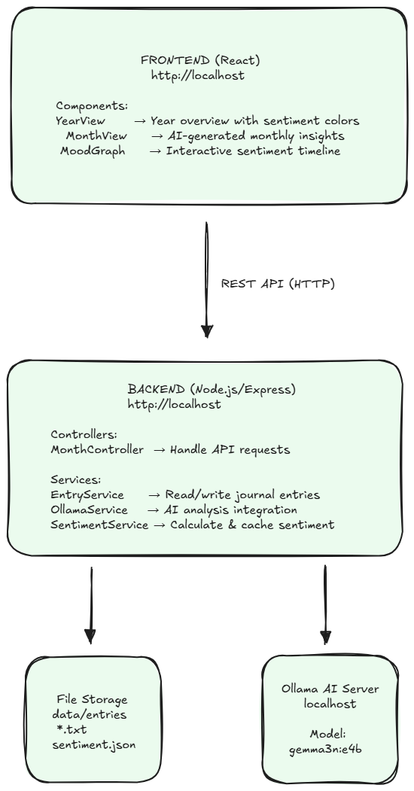
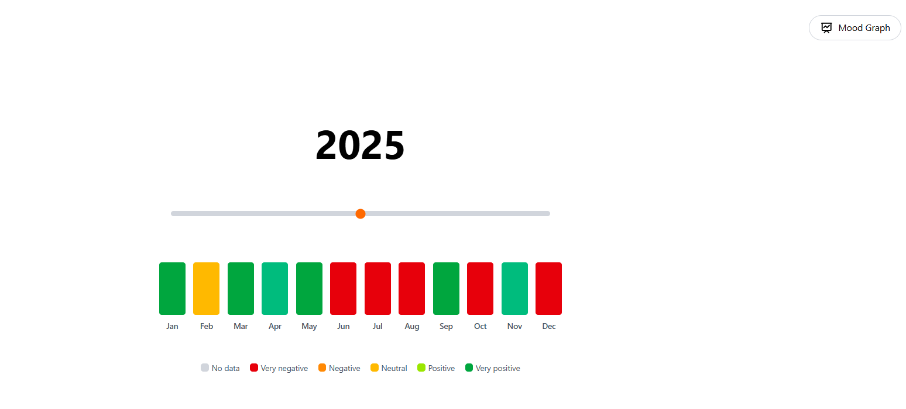
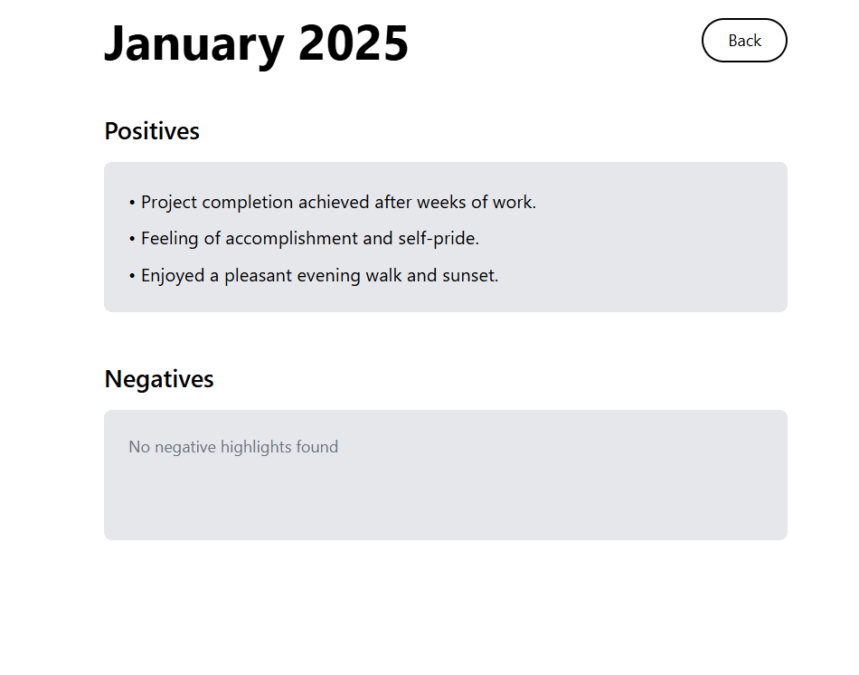
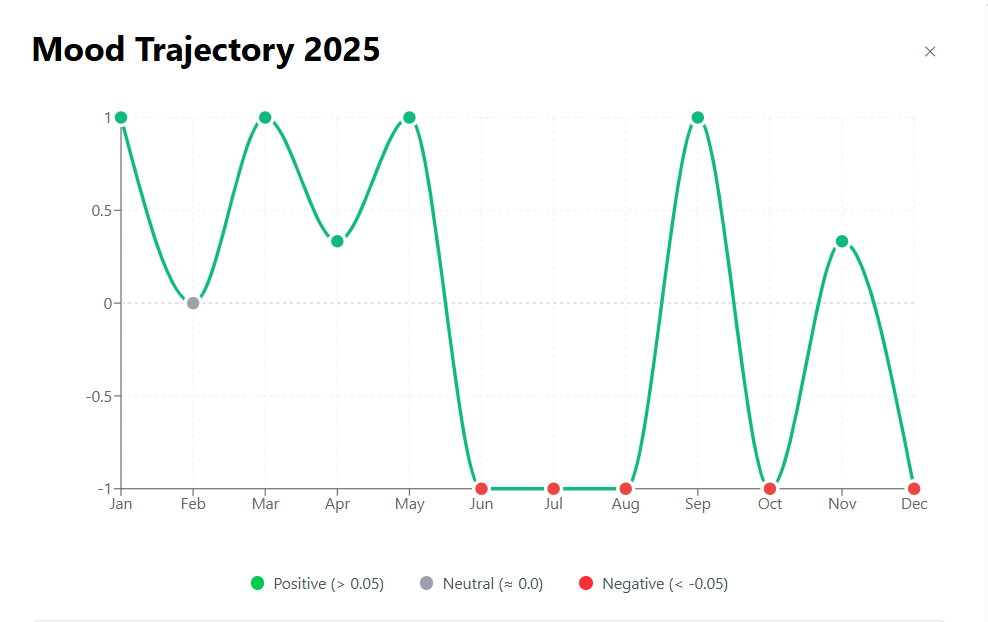

# Emotia – AI Mood Tracker

Emotia is an AI-powered mood tracking app. Based on users daily entries, performs sentiment analysis on text data, and visualizes emotional trends over time to promote mindfulness and emotional awareness.

---

## 🎯 Key Design Decisions

### 🗂️ File-based Storage for Entries
- Simple and human-readable  
- Easy to back up or manually edit  
- No external database required  

### ⚡ Cached Sentiment Scores
- Prevents re-analysis on every page load  
- Enables fast and smooth graph rendering  
- Re-analyzes only when entries are updated  

### 🧠 AI-Powered Analysis
- **Ollama** runs locally ensuring privacy  
- Utilizes the **gemma3n:e4b** model  
- Employs structured prompts for consistent and reliable results  

### 🌈 Sentiment Color Mapping
- Offers intuitive visual feedback  
- Color scheme:  
  - 🟥 Red → Negative  
  - 🟨 Yellow → Neutral  
  - 🟩 Green → Positive  
  - ⬜ Gray → Missing Data  

### ⚛️ React State Management
- Simple state, no Redux overhead  
- `useEffect` for data fetching  
- Clean component communication via props  

---

## 🛠️ Tech Stack

**Frontend**  
- ⚛️ React + Vite — Lightweight, fast local-first UI  
- 🎨 Tailwind CSS — Utility-first, responsive design  

**Backend / AI Engine**  
- 🧠 Node.js/Express — Local logic and summary generation  
- 🤖 Ollama + Gemma 3n — Local LLM inference for sentiment analysis, positive & negative summaries.

> 🔐 Everything runs locally — no cloud, no backend server, no external API calls.

---
## 🧭 Architecture Overview

Here's how Emotia is structured:

---
## 📺 Demo Video

🎥 [Watch the Emotia Demo on YouTube](https://youtu.be/AVnyiI5V_g0?si=8V1WkoBTXV8aR4Ek)

---

## 🖼️ App Screenshots

| Year View | Month View | Mood Trajectory | 
|-------------|---------------|----------------|
|  |  |  |

---
## 🚧 Future Enhancements

### 🧠 Context-Aware Mood Tracking
- Move beyond manual log entries.  
- Allow Emotia’s AI to analyze **emails, notes, and messages** (with user consent).  
- Detect mood trends automatically from the user’s digital footprint.

---

## 📄 License

This project is licensed under the **Creative Commons Attribution-NonCommercial 4.0 International (CC BY-NC 4.0)** license.

You are free to:

- ✅ Share — copy and redistribute the app in any medium or format  
- ✅ Adapt — remix, transform, and build upon the app

Under the following terms:

- ✍️ **Attribution** — You must give appropriate credit, link to this license, and indicate if changes were made.  
- 🚫 **NonCommercial** — You may not use the material for commercial purposes.

🔗 [View the full license terms here](https://creativecommons.org/licenses/by-nc/4.0/)
